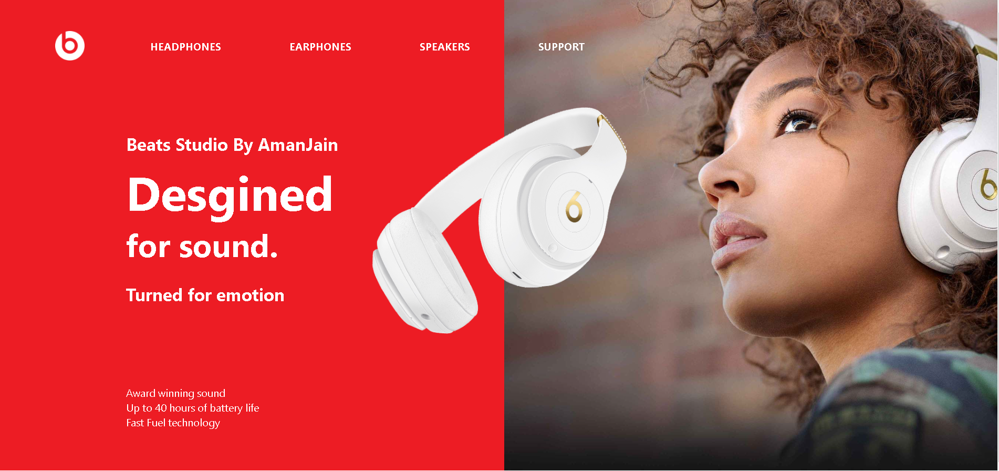

# Beats-Website_HTML-CSS
HTML AND CSS UI WEBSITE PRACTICE

# I Am Aman Jain

This is my second project of my Fullstack Javascript Web development project. 
Today i have Created Instagram resposnsive clone using HTML & CSS.

## What I have learnt in this Project
  
- How to align the basic Html elements using Positions
- I discovered the font familiy 
- I get to know about how to fetch the color codes if I have an image 
- Apart form this I get some clarity in Setting Margins Paddings and border 

## Time Spent on this project

- This project tooks my 6 hrs...

## Screenshot of my Project

)
